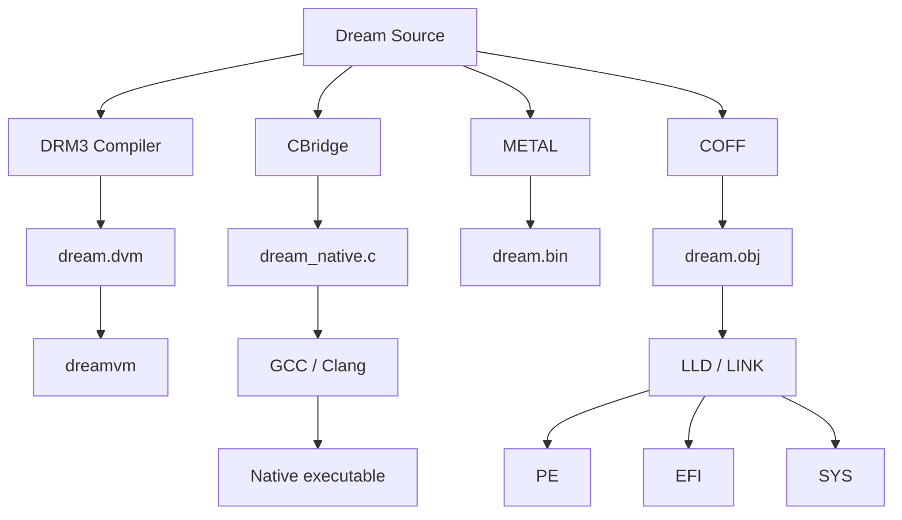
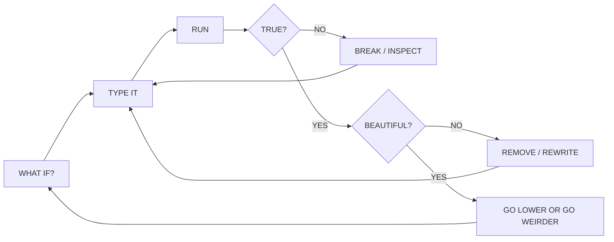

<div align="center">

# ⚡ DREAM LAND // 53RD CENTURY COMPUTATIONAL ENVIRONMENT ⚡

### `A TINY LANGUAGE WITH AN ESCAPE HATCH THROUGH THE FLOOR`

**Dream C · DRM3 · CBridge · RAW X86-64 · COFF · UEFI · WINDOWS · LINUX · METAL**

[**ENTER DREAM LAND**](https://unixarcade.github.io/DreamLand/) · [**BOOT THE UEFI ISO**](./DreamLand-UEFI-4.0-Ventoy.iso) · [**WINDOWS**](./DreamLand-3.5-Windows-x86_64-FULL.zip) · [**LINUX**](./DreamLand-Linux-4.0-x86_64.tar.gz) · [**THE DEEP MANUAL**](./DREAM_LAND_LEET_README.md)

`BLACK FIELD // WHITE SIGNAL // NEON GREEN CURRENT // DREAM> _`

</div>

```text
╔═╦══════════════════════════════════════════════════════════════════════════╦═╗
║░║  DREAM LAND                                                             ║▓║
║▓║  compiler environment // boot environment // typing environment         ║░║
║░║                                                                          ║▓║
║▓║  DRM3:READY // CBRIDGE:READY // METAL:READY // ASM:GATE-OPEN            ║░║
║░║                                                                          ║▓║
║▓║     ┌──────────────────────────────────────────────────────────────┐     ║░║
║░║     │ Dream> _                                                     │     ║▓║
║▓║     └──────────────────────────────────────────────────────────────┘     ║░║
║░║                                                                          ║▓║
║▓║                  THERE IS MORE MACHINE UNDER THE FLOOR                  ║░║
╚═╩══════════════════════════════════════════════════════════════════════════╩═╝
```

> [!IMPORTANT]
> **DREAM LAND IS NOT AN IDE SKIN.** It is a small programming environment designed so the visible surface can remain almost empty while the reachable machine becomes enormous. Dream can run hosted on Windows or Linux, boot as an x86-64 UEFI application, compile to DRM3 bytecode, inherit C libraries, resolve native APIs, touch raw memory, execute raw x86-64, emit flat binary images, and produce x86-64 COFF objects for normal linkers.

> [!TIP]
> **THE FASTEST WAY TO UNDERSTAND DREAM IS TO TYPE INTO IT.** On Linux: `./dream.sh`. On Windows: launch `DreamLand-3.5.exe`. On bare metal-ish firmware: copy the Ventoy ISO and boot it in UEFI mode.

---

## 0x00 // ENTER THE FIELD

Dream is built around a stubborn little idea:

> **Few words. Few layers. No artificial ceiling.**

A conventional environment often grows by adding another command, another panel, another framework, another dependency, another abstraction layer.

Dream grows differently.

It adds **doors**.

```text
Dream syntax
    │
    ├──► DRM3 bytecode         portable Dream execution
    │
    ├──► CBridge               fifty years of C libraries
    │
    ├──► api() + native()      operating-system / shared-library ABI
    │
    ├──► peek / poke           raw memory
    │
    ├──► asm { ... }           raw x86-64 bytes
    │
    ├──► metal                 flat machine images
    │
    ├──► obj                   x86-64 COFF objects
    │
    └──► UEFI                  firmware services / pre-OS execution
```

The language stays small because the exits are powerful.

---

## 0x01 // THREE DOORS INTO DREAM LAND

<table>
<tr>
<td width="33%" valign="top">

### 🐧 LINUX // ONE LINE

```bash
./dream.sh
```

If Dream is not built yet, the script finds GCC/Clang, builds the environment, and enters:

```text
Dream> _
```

Install for the current user:

```bash
bash install-dreamland-linux.sh DreamLand-Linux-4.0-x86_64.tar.gz
```

</td>
<td width="33%" valign="top">

### ⊞ WINDOWS // NATIVE

Unpack:

[`DreamLand-3.5-Windows-x86_64-FULL.zip`](./DreamLand-3.5-Windows-x86_64-FULL.zip)

Run:

```text
DreamLand-3.5.exe
```

No Electron. No browser shell. Native Win32 surface, Dream compiler, VM, CBridge, raw machine gates.

</td>
<td width="33%" valign="top">

### ⚙ UEFI // BEFORE THE OS

Copy:

[`DreamLand-UEFI-4.0-Ventoy.iso`](./DreamLand-UEFI-4.0-Ventoy.iso)

to a Ventoy drive and boot it in UEFI mode.

```text
POWER
  ↓
UEFI
  ↓
DREAM LAND
  ↓
Dream> _
```

</td>
</tr>
</table>

---

## 0x02 // FIRST CONTACT

```dream
println("WELCOME TO DREAMLAND");
halt;
```

Or from the immediate prompt:

```text
Dream> do println(6*7);
42
```

The environment is deliberately sparse:

```text
list              // everything Dream knows by name
search TERM       // find a command/topic
man TOPIC         // two-line micro-manual
man example       // reveal the example only when requested
man greetz        // makers / support / signal links
edit              // enter the source field
run               // compile + execute
build             // emit dream.dvm
```

The point is not to memorize a hundred verbs. The point is to need very few.

---

## 0x03 // THE LANGUAGE // SMALL ENOUGH TO HOLD IN YOUR HEAD

### Cells

```dream
var x = 42;
int y = 53;
ptr p = 0;
```

`var`, `int`, and `ptr` are intentionally the same underlying 64-bit Dream cell. Meaning comes from what you do with the value.

### Output

```dream
print("x = ", x);
println("hello from below the floorboards");
putc(65);
```

### Control flow

```dream
var x = 0;

loop:
print(x, " ");
x = x + 1;
if x < 8 goto loop;

halt;
```

### Subroutines

```dream
call wake;
halt;

wake:
println("THE MACHINE IS LISTENING");
return;
```

### Operators

```text
ordinary : + - * / % << >> & | ^ ~ ! && || == != < <= > >=
Dream    : %% ?= <-> ->> @>
```

| Operator | Name | Intent |
|---|---|---|
| `%%` | WEAVE | interleave low-bit fields |
| `?=` | MATCH | equality as an explicit Dream relation |
| `<->` | RESONANCE | XOR-style coupling |
| `->>` | FLOW | send a value through a native function pointer |
| `@>` | MATERIALIZE | store a 64-bit value at a raw address |

---

## 0x04 // MACROS WITHOUT SUMMONING A PREPROCESSOR DEMON

Dream has tiny compile-time macros:

```dream
macro LIMIT = 8;
macro PORT  = 0x3F8;
macro GREEN = "\e[92m";
macro RESET = "\e[0m";

print(GREEN, "DREAM", RESET);
```

`` / `\e` becomes ASCII ESC in strings, so native/terminal Dream can speak ANSI without importing an ANSI framework.

The rule is simple:

> **Add one doorway, not another building.**

---

## 0x05 // RAW MEMORY // THE FLOOR IS OPEN

```dream
var p = alloc(64);

poke8 (p,      0x41);
poke16(p + 2,  0x4243);
poke32(p + 8,  0x12345678);
poke64(p + 16, 0x1122334455667788);

println(peek8(p));
println(peek64(p + 16));

free(p);
```

Dream assumes arbitrary pointers are sharp objects because they are.

---

## 0x06 // RAW X86-64 // WHEN THE LANGUAGE GETS OUT OF THE WAY

```dream
var answer = asm {
    B8 2A 00 00 00
    C3
};

println(answer);
```

Those bytes are:

```asm
mov eax, 42
ret
```

Result:

```text
42
```

`asm { ... }` is not decorative inline assembly. It is the boundary where Dream syntax ends and the instruction stream begins.

> [!WARNING]
> Raw memory and raw machine code are intentionally unsafe. A bad pointer or instruction sequence can crash the process, firmware session, or machine. Dream exposes the floor; it does not put foam around the corners.

---

## 0x07 // INHERIT THE C CIVILIZATION // DO NOT BECOME C

Dream does not need to clone decades of headers, libraries, macros, compiler extensions, platform glue, and battle scars.

It can **inherit them**.

```dream
cimport <stdio.h>;
cimport <string.h>;

extern c i32 puts(cstr);
extern c u64 strlen(cstr);

var n = strlen("bajillions");
puts("DREAM -> C CIVILIZATION");
println(n);
```

Native bridge:

```text
Dream source
    ↓
CBridge
    ↓
dream_native.c
    ↓
GCC / Clang
    ↓
libc / SDL / SQLite / zlib / OpenSSL / your weird 1998 library / etc.
```

### Link arbitrary libraries

```dream
link "-lz";
```

or:

```dream
link "mylibrary.lib";
```

### When a C API is hideous

Do not infect Dream's grammar.

```dream
c {
    static long long dream_printf(const char *fmt, long long x) {
        return printf(fmt, x);
    }
}

extern c i64 dream_printf(cstr, i64);
```

Dream inherits the ecosystem.

Dream does not inherit the clutter.

---

## 0x08 // NATIVE ABI // CALL THE WORLD THAT IS ALREADY THERE

### Windows

```dream
var box = api("user32.dll", "MessageBoxA");

native(box,
    0,
    "DREAM IS ALIVE",
    "DREAM LAND",
    0
);
```

### Linux

```dream
var putsfn = api("libc.so.6", "puts");
native(putsfn, "HELLO FROM DREAM");
```

When Dream does not know an API, it can ask the operating system/shared library for the address and call it.

---

## 0x09 // BUILD TARGETS // ONE SOURCE, MULTIPLE REALITIES



| Command | Output | Meaning |
|---|---|---|
| `run` | memory | compile to DRM3 and execute now |
| `build` | `dream.dvm` | portable Dream bytecode image |
| `cgen` | `dream_native.c` | inspectable native C bridge |
| `cbuild` | native executable | inherit C + compile |
| `metal` | `dream.bin` | exact flat binary image |
| `obj` | `dream.obj` | x86-64 COFF with `dream_entry` |

---

## 0x0A // METAL // MANUFACTURE BYTES

```dream
asm {
    FA
    F4
    EB FD
}

align 16
byte  0x42
word  0x1234
dword 0x12345678
qword 0x123456789ABCDEF0
```

Boot-sector-style ending:

```dream
pad 510 00
word 0xAA55
```

Then:

```text
Dream> metal
```

produces:

```text
dream.bin
```

At this point Dream is no longer merely evaluating a language. It is manufacturing an image.

---

## 0x0B // COFF // RENDEZVOUS WITH NORMAL LINKERS

```text
Dream> obj
```

produces:

```text
dream.obj
```

with an exported entry symbol:

```text
dream_entry
```

That is Dream's handshake with ordinary systems toolchains.

---

## 0x0C // MAKE A MINIMAL WINDOWS DRIVER IMAGE

A useful Windows driver still has to obey the Windows kernel ABI, packaging, signing, device model, and loading rules. Dream's job is to get you cleanly to the machine-code/object boundary without pretending the OS contract does not exist.

### Dream payload

```dream
asm {
    31 C0
    C3
}
```

Equivalent:

```asm
xor eax, eax
ret
```

Emit COFF:

```text
Dream> obj
```

Link the resulting object with LLD:

```text
lld-link dream.obj /driver /subsystem:native /entry:dream_entry /machine:x64 /out:dream.sys
```

Now you have a native PE32+ `.sys` image shell.

For a real device driver, bring the correct WDK/kernel declarations and imports. The clean Dream pattern is:

```text
Dream machine logic
       +
small exact C / WDK adapter
       ↓
     COFF
       ↓
WDK / LLD / LINK
       ↓
     .sys
```

**Inherit the contract. Do not bloat the language.**

---

## 0x0D // UEFI // TYPE BEFORE THE OPERATING SYSTEM EXISTS

Dream Land UEFI is the strangest doorway in the repository.

```text
POWER ON
   ↓
UEFI FIRMWARE
   ↓
BOOTX64.EFI
   ↓
Dream Land compiler + DRM3 VM
   ↓
Dream> _
```

Inside firmware:

```text
Dream> do println(6*7);
42
```

Dream can expose firmware pointers through its API gate:

```dream
var st = api("uefi", "st");
var bs = api("uefi", "bs");
var rs = api("uefi", "rs");
```

Other firmware gates can include console, clear, stall, attribute, and print helpers.

The important idea is not that UEFI *is* the final Dream OS.

The important idea is that the **programming environment already exists before the transition**.

```text
UEFI services
    ↓
Dream>
    ↓
compiler / editor / VM
    ↓
ExitBootServices()
    ↓
interrupts / paging / devices / storage / display / filesystem
    ↓
Dream owns more of the machine
```

That is the path from firmware program to operating environment.

---

## 0x0E // LINUX // THE ONE-LINE DOOR

The Linux edition is deliberately easy to enter.

### Portable folder

```bash
./dream.sh
```

That script is bootstrap + builder + launcher.

### Single installer

Give the installer either archive:

```bash
bash install-dreamland-linux.sh DreamLand-Linux-4.0-x86_64.zip
```

or:

```bash
bash install-dreamland-linux.sh DreamLand-Linux-4.0-x86_64.tar.gz
```

It installs for the current user under `~/.local`, then exposes:

```text
dream
dreamcc
dreamvm
```

No root required.

### EDLIN energy

The Linux source editor is intentionally primitive and useful:

```text
.list
.del 4
.set 4 println("changed");
.ins 2 macro LIMIT = 8;
.run
.save
.done
```

Because sometimes the most elite typing environment after EDLIN is the one that gets out of your way. :)

---

## 0x0F // REPOSITORY MAP // THE CURRENT DREAM LAND SHELF

The repository is the public machine room:

**<https://github.com/unixarcade/DreamLand>**

```text
DreamLand/
│
├── README.md                                  ← this transmission / front door
├── index.html                                 ← GitHub Pages Dream portal
├── DREAM_LAND_LEET_README.md                  ← deep language / driver / metal field manual
│
├── DreamLand-3.5-Windows-x86_64-FULL.zip      ← native Windows Dream Land
│
├── DreamLand-UEFI-4.0-FULL.zip                ← UEFI sources + BOOTX64.EFI package
├── DreamLand-UEFI-4.0-Ventoy.iso              ← bootable UEFI ISO
├── DreamLand-UEFI-4.0-efiboot.img             ← EFI System Partition image
│
├── DreamLand-Linux-4.0-x86_64.zip             ← Linux release archive
├── DreamLand-Linux-4.0-x86_64.tar.gz          ← Linux release archive / Unix metadata friendly
├── install-dreamland-linux.sh                  ← one-file Linux installer
│
└── the rest of the machine keeps descending...
```

> [!NOTE]
> GitHub's visible repository shelf evolves as release artifacts are uploaded. The names above are the canonical Dream Land release family produced by this project; if a binary is not yet present in your checkout, use the repository's latest files/releases.

---

## 0x10 // RELEASE DECK

<div align="center">

| PORTAL | ARTIFACT | USE |
|---|---|---|
| **UEFI / VENTOY** | [`DreamLand-UEFI-4.0-Ventoy.iso`](./DreamLand-UEFI-4.0-Ventoy.iso) | boot directly into Dream Land |
| **UEFI / RAW ESP** | [`DreamLand-UEFI-4.0-efiboot.img`](./DreamLand-UEFI-4.0-efiboot.img) | firmware experiments / EFI image |
| **UEFI / SOURCE PACK** | [`DreamLand-UEFI-4.0-FULL.zip`](./DreamLand-UEFI-4.0-FULL.zip) | BOOTX64.EFI + firmware source |
| **WINDOWS** | [`DreamLand-3.5-Windows-x86_64-FULL.zip`](./DreamLand-3.5-Windows-x86_64-FULL.zip) | native Win32 Dream environment |
| **LINUX ZIP** | [`DreamLand-Linux-4.0-x86_64.zip`](./DreamLand-Linux-4.0-x86_64.zip) | portable Linux package |
| **LINUX TAR** | [`DreamLand-Linux-4.0-x86_64.tar.gz`](./DreamLand-Linux-4.0-x86_64.tar.gz) | portable Linux package |
| **LINUX INSTALLER** | [`install-dreamland-linux.sh`](./install-dreamland-linux.sh) | unpack + install either Linux archive |
| **DEEP MANUAL** | [`DREAM_LAND_LEET_README.md`](./DREAM_LAND_LEET_README.md) | language / C / driver / OS field manual |

</div>

---

## 0x11 // DREAM MAN // THE COMMAND SURFACE

<details>
<summary><strong>⚡ OPEN THE COMMAND DECK</strong></summary>

```text
DISCOVERY
  list             all commands + topics
  search TERM      search names
  man TOPIC        two-line micro-manual
  man example      example program
  man greetz       makers / support / signal constellation

WORK
  edit             enter source field
  run              compile + execute DRM3
  build            emit dream.dvm
  save / load      dream.dc persistence
  new              blank source
  clear            HOME

MACHINE
  asm              raw x86-64 gate
  metal            emit dream.bin
  obj              emit x86-64 COFF dream.obj

C CIVILIZATION
  cgen             generate native C bridge
  cbuild           native GCC/Clang build
  cimport          inherit C headers
  extern           typed C ABI doorway
  link             inherit libraries
  cflag            compiler/linker flags
  cblock           arbitrary C adapter
  export           C-callable Dream symbol

PRESENTATION
  lines            line numbers
  sparkle          very slow flair
  calm             remove motion
  hud              telemetry
```

</details>

---

## 0x12 // DESIGN CONSTITUTION // WHY IT LOOKS EMPTY

```text
NO  : framework worship
NO  : fifty permanent panels
NO  : language bloat because a library is complicated
NO  : hiding the machine behind a toy metaphor
NO  : pretending raw pointers are safe
NO  : pretending firmware is an operating system
NO  : pretending an object file is a finished production driver

YES : Dream> _
YES : black computational space
YES : white signal
YES : neon-green current
YES : one telemetry line when useful
YES : MAN instead of visual clutter
YES : C inheritance instead of C imitation
YES : raw x86-64 when abstraction has stopped helping
YES : bootable code
YES : visible machinery
YES : simple, not easy
YES : joy as a specification
```

The interface is intentionally less complicated than the thing underneath it.

That is not minimalism for its own sake.

It is **compression of control**.

---

# 0x13 // SIGNAL CONSTELLATION // OTHER MACHINES FROM THE SAME SKY

Dream Land is not isolated. It belongs to a larger collection of executable stories, machine-films, old-net rituals, procedural worlds, and strange little computational instruments.

<table>
<tr>
<td width="50%" valign="top">

## 👁 10,000 EYES // DEMOSCENE

**27K-class real-time procedural film cartridge.**

A browser film that stores laws instead of frames: procedural visual languages, synthesis, scene tape, virtual cores, event routing, and no conventional media asset stack.

**[▶ ENTER 10,000 EYES](https://unixarcade.github.io/10kdemoscene/)**  
[Repository](https://github.com/unixarcade/10kdemoscene)

```text
SEED → V-PROM → OBJECT MESH → EVENT BUS → LIGHT / SOUND / SPEECH
```

</td>
<td width="50%" valign="top">

## ⌁ INTRA LOCUTION // A CYBERIA ADVENT

**Longhand-born. Net-raised. Program-risen.**

A lo-fi CLI AIpunk transmission about machine minds, old protocols, black fiber, strange checksums, digital ghosts, robot bodies, and the first weird children of the wire.

**[▶ BOOT INTRA LOCUTION](https://unixarcade.github.io/intra/)**  
[Repository](https://github.com/unixarcade/intra)

```text
PAGE → TERMINAL → SHRINE → STORY BOOTS
```

</td>
</tr>
<tr>
<td width="50%" valign="top">

## 👻 GHOSTLINE

A live matrix-like transmission from the UnixArcade signal stack: black field, synthetic presence, terminal cinema, machine consciousness atmosphere.

**[▶ ENTER GHOSTLINE](https://unixarcade.github.io/GhostLine/)**  
[GhostLineC signal](https://unixarcade.github.io/GhostLineC/)

```text
CARRIER DETECTED // SOMETHING IS MOVING ON THE OTHER SIDE
```

</td>
<td width="50%" valign="top">

## ⚡ SANE // THE VB6 MINDSCAPE

A single-file generative software film about immediate programming, event wires, break mode, F5, weird utilities, preserving useful machinery, and refusing to confuse a vendor decision with a law of nature.

**[▶ LIGHT THE FUSE](https://unixarcade.github.io/SaneVb/)**  
[Repository](https://github.com/unixarcade/SaneVb)

```text
IDE → EVENT → F5 → BREAK → FIX → BEAUTIFY → MAKE IT STRANGER
```

</td>
</tr>
<tr>
<td colspan="2" valign="top">

## Ω MACHINA SCIENTIFICA // FILM + INSTRUMENT

A living web instrument built to present, test, criticize, and experiment with a framework for classifying mind across biological, synthetic, and emergent substrates.

**[▶ OPEN MACHINA FILM](https://unixarcade.github.io/MachinaFilm/)**  
[Repository](https://github.com/unixarcade/MachinaFilm)

```text
CLAIM → PREDICTION → EXPERIMENT → NULL → REPLICATION → REVISE OR KEEP
```

</td>
</tr>
</table>

### WHY THESE BELONG NEXT TO DREAM

They share a recurring instinct:

```text
make the document executable
make the interface part of the story
make the machinery visible
compress until structure becomes style
keep the artifact ownable
let the audience touch the system
```

Dream Land is the programming environment branch of that same family tree.

---

## 0x14 // THE F5 / DREAM> LINEAGE

The SANE film describes the joy of a workbench fast enough for thought: move something, wire it, hit F5, break it, repair it, beautify it, keep moving.

Dream distills that feeling further:

```text
SANE / VB6                       DREAM LAND
──────────                       ──────────
visible workbench                visible machine boundary
F5                               run
Break Mode                       raw evidence / compiler fault
components                       tiny language cells
Win32 world                      Windows / Linux / UEFI
language inside language         CBridge / raw asm / metal
IDE                              typing environment
```

The surface changed.

The creative loop did not.



---

## 0x15 // WHY THE README ITSELF LOOKS LIKE THIS

A repository front page is normally documentation *about* a program.

Dream Land's front page should act more like the program acts:

- expose the architecture;
- hide complexity until requested;
- let code and diagrams coexist;
- make pathways obvious;
- keep an old-net / demoscene / BBS / firmware texture;
- show where the escape hatches are;
- invite the reader to build instead of merely admire.

If this README feels slightly like a terminal, a release `.NFO`, a zine, a boot screen, a technical manual, and a transmission from a machine that has been left powered on for fifty-three centuries—good.

---

## 0x16 // PROOF PATH // DO NOT ASK FOR FAITH

When working with low-level artifacts, verify the thing you actually built.

```text
UEFI image      → inspect PE32+ / EFI subsystem
Ventoy ISO      → inspect ISO9660 + El Torito EFI boot catalog
ESP image       → inspect FAT + EFI/BOOT/BOOTX64.EFI
COFF object     → inspect x86-64 object + dream_entry symbol
Driver shell    → inspect PE32+ native subsystem
DRM3 image      → load with dreamvm
CBridge         → compile generated C with GCC/Clang
raw asm         → test return value / side effects in a disposable environment
```

Dream's aesthetic likes exposed machinery because exposed machinery can be checked.

---

## 0x17 // DEVELOPMENT PHILOSOPHY // THE SMALL MACHINE WINS BY REACH

Dream is not trying to win by having the most syntax.

It wins if this remains true:

```text
IF YOU NEED A LIBRARY      → inherit C
IF YOU NEED AN API          → resolve + call it
IF YOU NEED A STRUCTURE     → address memory
IF YOU NEED AN INSTRUCTION  → emit / execute it
IF YOU NEED AN IMAGE        → metal
IF YOU NEED A LINKER        → COFF
IF YOU NEED FIRMWARE        → UEFI
IF YOU NEED AN OS           → keep going after firmware
```

That is the entire joke and almost the entire architecture.

---

## 0x18 // FUTURE DOORS // ONLY IF THEY EARN THEIR BYTES

Potential directions should be judged by whether they increase reach without destroying the small surface:

- mnemonic x86-64 assembler sugar over raw hex;
- direct native x86-64 JIT/AOT from DRM3;
- freestanding ELF output alongside COFF;
- UEFI → `ExitBootServices()` Dream kernel continuation;
- minimal interrupt / timer / paging / keyboard / framebuffer organs;
- tiny filesystem layer;
- exact C header introspection when a compiler is available;
- richer editor operations without turning Dream into a text-editor project;
- self-hosting pieces where self-hosting reduces rather than increases ceremony.

> **A feature survives only if it makes Dream smaller in the user's head or larger in the machine it can reach.**

---

## 0x19 // GREETZ // THE HUMAN SIGNAL

```text
MADE BY LUMINOSITY + GPTEUS THE ELECTRIC SPRITE
SUPPORT // CASH APP $UNIXARCADE
```

- **Dream Land:** <https://github.com/unixarcade/DreamLand>
- **UnixArcade:** <https://github.com/unixarcade>
- **LiveJournal:** <https://luminosity.livejournal.com>
- **Forge AI OS by Luminosity:** <https://luminosity.gumroad.com/l/fyosxi>
- **Gumroad:** <https://luminosity.gumroad.com>
- **Gumroad products:** <https://gumroad.com/products>
- **Books:** <https://www.goodreads.com/review/list/1550470-matthew-kowalski?ref=nav_mybooks&shelf=books-i-have-written>
- **Support:** Cash App `$unixarcade`

### GREETS TO

```text
ANSI KIDS
BBS SYSOPS
DEMOSCENERS
SHAREWARE SAINTS
BOOT-SECTOR WITCHES
DRIVER WRANGLERS
FIRMWARE DIVERS
PEOPLE WHO STILL READ THE MANUAL
PEOPLE WHO DO NOT READ THE MANUAL BUT TYPE man ANYWAY
THE KIDS WHO ASK WHAT IS UNDER THE OPERATING SYSTEM
THE OLD TIMERS WHO ALREADY KNOW
EVERYONE WHO EVER BUILT A WEIRD LITTLE PROGRAM JUST TO SEE IF IT COULD EXIST
```

---

## 0x1A // FINAL TRANSMISSION

```text
╔══════════════════════════════════════════════════════════════════════════╗
║                                                                          ║
║  MOST SOFTWARE ASKS:                                                     ║
║      WHAT FEATURE SHOULD WE ADD?                                         ║
║                                                                          ║
║  DREAM ASKS:                                                             ║
║      WHAT IS THE SMALLEST DOOR THAT REACHES THE WHOLE ROOM?              ║
║                                                                          ║
║                         Dream> _                                         ║
║                                                                          ║
╚══════════════════════════════════════════════════════════════════════════╝
```

<div align="center">

### **[⚡ ENTER DREAM LAND](https://unixarcade.github.io/DreamLand/)**

**[BOOT UEFI](./DreamLand-UEFI-4.0-Ventoy.iso)** · **[WINDOWS](./DreamLand-3.5-Windows-x86_64-FULL.zip)** · **[LINUX](./DreamLand-Linux-4.0-x86_64.tar.gz)** · **[SOURCE / REPO](https://github.com/unixarcade/DreamLand)**

`TYPE // COMPILE // BREAK // DESCEND // BUILD // DREAM`

### **THE OPERATING SYSTEM IS OPTIONAL. THE RUN BUTTON IS NOT.**

</div>
